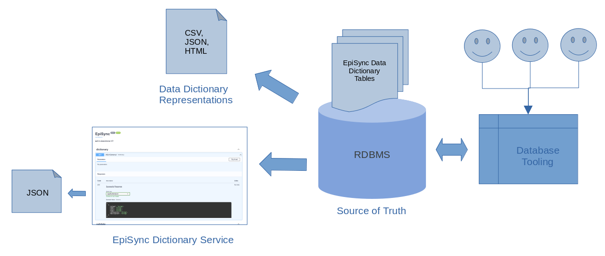

# NEDSS-EpiSync


A CLI, components and services for:
- Creating, Serving & Managing EpiSync Data Dictionary
- Validating EpiSync data
- Publishing EpiSync data

## Quickstart

```bash
$ make build
$ make up
docker compose up -d
[+] Running 10/10
 ⠿ Container episync-dd       Running                                                                                                                                                         0.0s
 ⠿ Container episync-cli      Running                                                                                                                                                         0.0s
 ⠿ Container minio3           Running                                                                                                                                                         0.0s
 ⠿ Container episync-publish  Started                                                                                                                                                         0.6s
 ⠿ Container episync-test     Started                                                                                                                                                         0.6s
 ⠿ Container pgadmin          Running                                                                                                                                                         0.0s
 ⠿ Container minio2           Running                                                                                                                                                         0.0s
 ⠿ Container minio1           Running                                                                                                                                                         0.0s
 ⠿ Container minio4           Running                                                                                                                                                         0.0s
 ⠿ Container episync-db       Running                              
```

Then open browser to http://localhost:8014/docs for the `dictionary` and `validate` service Swagger UI's

To bring down the EpiSync stack:
```bash
$ make stop
docker compose stop
[+] Running 9/10
 ⠿ Container minio4           Stopped                                                                                                                                                         1.0s
 ⠿ Container episync-db       Stopped                                                                                                                                                         0.4s
 ⠿ Container minio1           Stopped                                                                                                                                                         1.3s
 ⠿ Container minio3           Stopped                                                                                                                                                         1.4s
 ⠿ Container episync-test     Stopped                                                                                                                                                         0.0s
 ⠿ Container pgadmin          Stopped                                                                                                                                                         1.8s
 ⠿ Container episync-publish  Stopped                                                                                                                                                         4.6s
 ⠸ Container episync-cli      Stopping                                                                                                                                                        6.4s
 ⠿ Container minio2           Stopped                                                                                                                                                         1.2s
 ⠿ Container episync-dd       Stopped                                                                                                                                                                                                                               0.8s                                                                              0.3s
```
## EpiSync CLI
The `episync` CLI is used to manage various aspects of the EpiSync services and eco-system such as data dictionary lifecycle, publishing data to S3 endpoints, etc.
```bash
$ episync
Usage: episync [OPTIONS] COMMAND [ARGS]...

Options:
  --debug         Debug switch
  -i, --ini TEXT  EpiSync .ini configuration file path
  --help          Show this message and exit.

Commands:
  api       EpiSync API server commands
  convert   Convert an HL7 message to target formats
  ddl       Commands to create and manage EpiSync Data Dictionary
  generate  Commands to generate EpiSync CSV data
  publish   Publish EpiSync CSV data to S3 bucket
  test      Commands to test EpiSync
  validate  Commands to validate EpiSync CSV data 
```
## Creating the EpiSync Data Dictionary
```bash
$ episync ddl create
```
## Dropping the EpiSync Data Dictionary
```bash
$ episync ddl drop
```
## Viewing the EpiSync Data Dictionary
```bash
$ episync ddl show
+--------------------------------+--------------------------------+-------------------+----------------------+-------------+---------------------------------------------+
|             Column             |              Name              |        Type       |         Rule         | Cardinality |                     XML                     |
+--------------------------------+--------------------------------+-------------------+----------------------+-------------+---------------------------------------------+
| episync_mmg_message_profile_id |   Message Profile Identifier   |         id        |         None         |     Y/2     |       HL7MSH.MessageProfileIdentifier       |
|            entifier            |                                |                   |                      |             |                                             |
|  episync_mmg_local_subject_id  |        Local Subject ID        |         id        |         None         |      N      | PatientIdentification.PatientIdentifierList |
|     episync_mmg_birth_date     |           Birth Date           |        date       |         None         |      N      |    PatientIdentification.DateTimeOfBirth    |
|        episync_mmg_sex         |         Subject’s Sex          |        sex        |         None         |      N      |   PatientIdentification.AdministrativeSex   |
|        episync_mmg_race        |         Race Category          |        race       | episync_mmg_race IN  |      Y      |          PatientIdentification.Race         |
|                                |                                |                   |   (PHINVADS_RACE)    |             |                                             |
|                                |                                |                   |                      |             |                                             |
|     episync_mmg_other_race     |        Other Race Text         |        race       |         None         |      N      |                     None                    |
|    episync_mmg_ethnic_group    |          Ethnic Group          |     ethnicity     |         None         |      N      |      PatientIdentification.EthnicGroup      |
|   episync_mmg_birth_country    |        Country of Birth        |      country      |         None         |      N      |                     None                    |
| episync_mmg_other_birth_place  |       Other Birth Place        |        city       |         None         |      N      |                     None                    |
| episync_mmg_country_of_residen |   Country of Usual Residence   |      country      |         None         |      N      |                     None                    |
|               ce               |                                |                   |                      |             |                                             |
| episync_mmg_subject_address_co |     Subject Address County     |       county      |         None         |      N      |                     None                    |
|              unty              |                                |                   |                      |             |                                             |
| episync_mmg_subject_address_st |     Subject Address State      |       state       |         None         |      N      |      PatientAddress.HL7StateOrProvince      |
|              ate               |                                |                   |                      |             |                                             |
| episync_mmg_subject_address_zi |    Subject Address ZIP Code    |        zip        |         None         |      N      |      PatientAddress.HL7ZipOrPostalCode      |
|               p                |                                |                   |                      |             |                                             |
| episync_mmg_date_of_illness_on |     Date of Illness Onset      |        date       |         None         |      N      |                     None                    |
|              set               |                                |                   |                      |             |                                             |
|  episync_mmg_illness_end_date  |        Illness End Date        |        date       |         None         |      N      |                     None                    |
|  episync_mmg_illness_duration  |        Illness Duration        |      duration     |         None         |      N      |                     None                    |
| episync_mmg_illness_duration_u |     Illness Duration Units     |     time_unit     |         None         |      N      |                     None                    |
|              nits              |                                |                   |                      |             |                                             |
|  episync_mmg_pregnancy_status  |        Pregnancy Status        |      yesnounk     |         None         |      N      |                     None                    |
|   episync_mmg_diagnosis_date   |         Diagnosis Date         |        date       | episync_mmg_diagnosi |      N      |                     None                    |
|                                |                                |                   | s_date > episync_mmg |             |                                             |
|                                |                                |                   | _birth_date AND (epi |             |                                             |
|                                |                                |                   | sync_mmg_diagnosis_d |             |                                             |
|                                |                                |                   | ate < episync_mmg_de |             |                                             |
|                                |                                |                   | ceased_date AND epis |             |                                             |
|                                |                                |                   | ync_mmg_diagnosis_da |             |                                             |
|                                |                                |                   | te < episync_mmg_ill |             |                                             |
|                                |                                |                   |    ness_end_date)    |             |                                             |
|    episync_mmg_hospitalized    |          Hospitalized          |      yesnounk     |         None         |      N      |                     None                    |
|   episync_mmg_admission_date   |         Admission Date         |        date       |         None         |      N      |                     None                    |
|   episync_mmg_discharge_date   |         Discharge Date         |        date       |         None         |      N      |                     None                    |
| episync_mmg_duration_of_hospit |  Duration of Hospital Stay in  |      duration     | episync_mmg_duration |      N      |                     None                    |
|        al_stay_in_days         |              Days              |                   | _of_hospital_stay_in |             |                                             |
|                                |                                |                   | _days > 0 and episyn |             |                                             |
|                                |                                |                   | c_mmg_duration_of_ho |             |                                             |
|                                |                                |                   | spital_stay_in_days  |             |                                             |
|                                |                                |                   |        < 120         |             |                                             |
|    episync_mmg_subject_died    |          Subject Died          |      yesnounk     |         None         |      N      |                     None                    |
|   episync_mmg_deceased_date    |         Deceased Date          |        date       |         None         |      N      |                     None                    |
|   episync_mmg_condition_code   |         Condition Code         |   condition_code  |         None         |      N      |                     None                    |
|  episync_mmg_local_record_id   |        Local Record ID         |         id        |         None         |      N      |     ObservationRequest.FillerOrderNumber    |
| episync_mmg_state_case_identif |     State Case Identifier      |         id        |         None         |      N      |                     None                    |
|              ier               |                                |                   |                      |             |                                             |
| episync_mmg_legacy_case_identi |     Legacy Case Identifier     |         id        |         None         |      N      |                     None                    |
|              fier              |                                |                   |                      |             |                                             |
| episync_mmg_age_at_case_invest |   Age at Case Investigation    |        age        |         None         |      N      |                     None                    |
|            igation             |                                |                   |                      |             |                                             |
| episync_mmg_age_unit_at_case_i | Age Unit at Case Investigation |       years       |         None         |      N      |                     None                    |
|          nvestigation          |                                |                   |                      |             |                                             |
| episync_mmg_case_disease_impor |   Case Disease Imported Code   |        code       |         None         |      N      |                     None                    |
|            ted_code            |                                |                   |                      |             |                                             |
|  episync_mmg_imported_country  |        Imported Country        |      country      |         None         |      N      |                     None                    |
|   episync_mmg_imported_state   |         Imported State         |       state       |         None         |      N      |                     None                    |
|   episync_mmg_imported_city    |         Imported City          |        city       |         None         |      N      |                     None                    |
|  episync_mmg_imported_county   |        Imported County         |      country      |         None         |      N      |                     None                    |
| episync_mmg_country_of_exposur |      Country of Exposure       |      country      |         None         |      N      |                     None                    |
|               e                |                                |                   |                      |             |                                             |
| episync_mmg_state_or_province_ | State or Province of Exposure  |   state/province  |         None         |      N      |                     None                    |
|          of_exposure           |                                |                   |                      |             |                                             |
|  episync_mmg_city_of_exposure  |        City of Exposure        |        city       |         None         |      N      |                     None                    |
| episync_mmg_county_of_exposure |       County of Exposure       |       county      |         None         |      N      |                     None                    |
| episync_mmg_transmission_mode  |       Transmission Mode        | transmission_mode |         None         |      N      |                     None                    |
| episync_mmg_case_class_status_ |     Case Class Status Code     |        code       |         None         |      N      |                     None                    |
|              code              |                                |                   |                      |             |                                             |
| episync_mmg_immediate_national | Immediate National Notifiable  |   condition_code  |         None         |      N      |                     None                    |
|     _notifiable_condition      |           Condition            |                   |                      |             |                                             |
| episync_mmg_case_outbreak_indi |    Case Outbreak Indicator     |       string      |         None         |      N      |                     None                    |
|             cator              |                                |                   |                      |             |                                             |
| episync_mmg_case_outbreak_name |       Case Outbreak Name       |       string      |         None         |      N      |                     None                    |
| episync_mmg_notification_resul |   Notification Result Status   |       string      |         None         |      N      |       ObservationRequest.ResultStatus       |
|            t_status            |                                |                   |                      |             |                                             |
| episync_mmg_jurisdiction_code  |       Jurisdiction Code        |        code       |         None         |      N      |                     None                    |
| episync_mmg_reporting_source_t |   Reporting Source Type Code   |        code       |         None         |      N      |                     None                    |
|            ype_code            |                                |                   |                      |             |                                             |
| episync_mmg_reporting_source_z |   Reporting Source ZIP Code    |        code       |         None         |      N      |                     None                    |
|            ip_code             |                                |                   |                      |             |                                             |
| episync_mmg_binational_reporti | Binational Reporting Criteria  |       string      |         None         |      Y      |                     None                    |
|          ng_criteria           |                                |                   |                      |             |                                             |
| episync_mmg_person_reporting_t | Person Reporting to CDC - Name |       string      |         None         |      N      |                     None                    |
|           o_cdc_name           |                                |                   |                      |             |                                             |
| episync_mmg_person_reporting_t |   Person Reporting to CDC -    |       phone       |         None         |      N      |                     None                    |
|          o_cdc_phone           |          Phone Number          |                   |                      |             |                                             |
| episync_mmg_person_reporting_t |   Person Reporting to CDC -    |       email       |         None         |      N      |                     None                    |
|          o_cdc_email           |             Email              |                   |                      |             |                                             |
| episync_mmg_case_investigation | Case Investigation Start Date  |        date       |         None         |      N      |                     None                    |
|          _start_date           |                                |                   |                      |             |                                             |
| episync_mmg_date_first_electro |   Date First Electronically    |        date       |         None         |      N      |    ObservationRequest.ObservationDateTime   |
|       nically_submitted        |           Submitted            |                   |                      |             |                                             |
| episync_mmg_date_of_electronic |    Date of Electronic Case     |        date       |         None         |      N      |                     None                    |
|   _case_notification_to_cdc    |      Notification to CDC       |                   |                      |             |                                             |
|   episync_mmg_date_reported    |         Date Reported          |        date       |         None         |      N      |                     None                    |
| episync_mmg_earliest_date_repo |   Earliest Date Reported to    |        date       |         None         |      N      |                     None                    |
|         rted_to_county         |             County             |                   |                      |             |                                             |
| episync_mmg_earliest_date_repo |   Earliest Date Reported to    |        date       |         None         |      N      |                     None                    |
|         rted_to_state          |             State              |                   |                      |             |                                             |
|     episync_mmg_mmwr_week      |           MMWR Week            |        week       |         None         |      N      |                     None                    |
|     episync_mmg_mmwr_year      |           MMWR Year            |        year       |         None         |      N      |                     None                    |
| episync_mmg_date_cdc_was_first |  Date CDC Was First Verbally   |        date       |         None         |      N      |                     None                    |
| _verbally_notified_of_this_cas |     Notified of This Case      |                   |                      |             |                                             |
|               e                |                                |                   |                      |             |                                             |
| episync_mmg_date_first_reporte |   Date First Reported to PHD   |        date       |         None         |      N      |                     None                    |
|            d_to_phd            |                                |                   |                      |             |                                             |
|  episync_mmg_reporting_state   |        Reporting State         |       state       |         None         |      N      |                     None                    |
|  episync_mmg_reporting_county  |        Reporting County        |       county      |         None         |      N      |                     None                    |
| episync_mmg_national_reporting |       National Reporting       |    jurisdiction   |         None         |      N      |                     None                    |
|         _jurisdiction          |          Jurisdiction          |                   |                      |             |                                             |
|      episync_mmg_comment       |            Comment             |        text       |         None         |      N      |                     None                    |
+--------------------------------+--------------------------------+-------------------+----------------------+-------------+---------------------------------------------+

$ episync ddl show -j
[
    {
        "col": "episync_mmg_message_profile_identifier",
        "name": "Message Profile Identifier",
        "type": "id",
        "rule": "",
        "cardinality": "Y/2",
        "description": "Message Profile Identifiers provide a literal value to use for the references in MSH-21. MSH-21 will always contain a reference to the notification type in the \"PHINProfileID\" namespace and a reference to the implemented version of the Generic MMG in the \"PHINMsgMapID\" namespace. For conditions that have a condition-specific MMG, MSH-21 will also contain a reference to that MMG that is also in the \"PHINMsgMapID\" namespace.",
        "xml": "HL7MSH.MessageProfileIdentifier"
    },
    {
        "col": "episync_mmg_local_subject_id",
        "name": "Local Subject ID",
        "type": "id",
        "rule": "",
        "cardinality": "N",
        "description": "The local ID of the subject/entity",
        "xml": "PatientIdentification.PatientIdentifierList"
    },
    {
        "col": "episync_mmg_diagnosis_date",
        "name": "Diagnosis Date",
        "type": "date",
        "rule": "episync_mmg_diagnosis_date > episync_mmg_birth_date AND (episync_mmg_diagnosis_date < episync_mmg_deceased_date AND episync_mmg_diagnosis_date < episync_mmg_illness_end_date)",
        "cardinality": "N",
        "description": "Earliest date of diagnosis (clinical or laboratory) of condition being reported to public health system.",
        "xml": ""
    },

...
$ 
```
## Publishing EpiSync .csv data to S3
```bash
$ episync publish --help
Usage: episync publish [OPTIONS]

  Publish EpiSync CSV data to S3 bucket

Options:
  --file TEXT        Source file of the data  [required]
  --path TEXT        S3 key path for the object  [required]
  --s3 TEXT          Target S3 endpoint  [required]
  -b, --bucket TEXT  Target S3 bucket  [required]
  --help             Show this message and exit.

$ episync publish --file data.csv --path /data.csv
# List data in S3
$ mc ls episync/mvps
[2023-05-18 20:51:36 EDT] 1.5KiB STANDARD data.csv
# Show the episync csv data in S3
$ mc cat episync/mvps/data.csv
episync_mmg_message_profile_identifier,episync_mmg_local_subject_id,episync_mmg_birth_date,episync_mmg_sex,episync_mmg_race,episync_mmg_other_race,episync_mmg_ethnic_group,episync_mmg_
birth_country,episync_mmg_other_birth_place,episync_mmg_country_of_residence,episync_mmg_subject_address_county,episync_mmg_subject_address_state,episync_mmg_subject_address_zip,episyn
c_mmg_case_date_of_illness_onset,episync_mmg_illness_end_date,episync_mmg_illness_duration,episync_mmg_illness_duration_units,episync_mmg_pregnancy_status,episync_mmg_diagnosis_date,ep
isync_mmg_hospitalized,episync_mmg_admission_date,episync_mmg_discharge_date,episync_mmg_duration_of_hospital_stay_in_days,episync_mmg_subject_died,episync_mmg_deceased_date,episync_mm
g_condition_code,episync_mmg_local_record_id,episync_mmg_state_case_identifier,episync_mmg_legacy_case_identifier,episync_mmg_age_at_case_investigation,episync_mmg_age_unit_at_case_inv
estigation,episync_mmg_case_disease_imported_code,episync_mmg_imported_country,episync_mmg_imported_state,episync_mmg_imported_city,episync_mmg_imported_county,episync_mmg_country_of_e
xposure,episync_mmg_state_or_province_of_exposure,episync_mmg_city_of_exposure,episync_mmg_county_of_exposure,episync_mmg_transmission_mode,episync_mmg_case_class_status_code,episync_m
mg_immediate_national_notifiable_condition,episync_mmg_case_outbreak_indicator,episync_mmg_case_outbreak_name,episync_mmg_notification_result_status,episync_mmg_jurisdiction_code,episy
nc_mmg_reporting_source_type_code,episync_mmg_reporting_source_zip_code,episync_mmg_binational_reporting_criteria,episync_mmg_person_reporting_to_cdc_name,episync_mmg_person_reporting_
to_cdc_phone,episync_mmg_person_reporting_to_cdc_email,episync_mmg_case_investigation_start_date,episync_mmg_date_first_electronically_submitted,episync_mmg_date_of_electronic_case_not
ification_to_cdc,episync_mmg_date_reported,episync_mmg_earliest_date_reported_to_county,episync_mmg_earliest_date_reported_to_state,episync_mmg_mmwr_week,episync_mmg_mmwr_year,episync_
mmg_date_cdc_was_first_verbally_notified_of_this_case,episync_mmg_date_first_reported_to_phd,episync_mmg_reporting_state,episync_mmg_reporting_county,episync_mmg_national_reporting_jur
isdiction,episync_mmg_comment
,,,,,,,,,,,,,,,,,,,,,,90,,,,,,,,,,,,,,,,,,,,,,,,,,,,,,,,,,,,,,,,,,,,
```
## Browsing Published Data in S3
EpiSync dev stack in this repo uses `minio`https://min.io/ S3 containers to simulate AWS S3 endpoints.

To easily work with S3 in this setting, please install the minio CLI: https://min.io/docs/minio/linux/reference/minio-mc.html#quickstart

Then set an S3 endpoint alias:
```bash
$ mc alias set episync  http://localhost:9000 minioadmin minioadmin
```
To list the episync bucket:
```bash
$ mc ls episync
[2023-05-18 04:15:14 EDT]     0B mvps/
(venv) darren@phoenix:~/git/NEDSS-EpiSync$ mc ls episync/mvps
[2023-05-18 04:53:51 EDT]    36B STANDARD data1
[2023-05-18 20:51:36 EDT] 1.5KiB STANDARD out.csv
[2023-05-26 08:02:29 EDT] 1.5KiB STANDARD out2.csv
```
Or you can log into the `episync-cli` container to run `mc` command there (the alias is pre-set):
```bash
$ docker exec -it episync-cli bash
mc: Configuration written to `/root/.mc/config.json`. Please update your access credentials.
mc: Successfully created `/root/.mc/share`.
mc: Initialized share uploads `/root/.mc/share/uploads.json` file.
mc: Initialized share downloads `/root/.mc/share/downloads.json` file.
Added `episync` successfully.
root@episync-cli:/opt/episync# mc ls episync/mvps
[2023-05-18 08:53:51 UTC]    36B STANDARD data1
[2023-05-19 00:51:36 UTC] 1.5KiB STANDARD out.csv
[2023-05-26 12:02:29 UTC] 1.5KiB STANDARD out2.csv
root@episync-cli:/opt/episync# 


```

## Docker Stack
```bash
$ docker ps
CONTAINER ID   IMAGE                                              COMMAND                  CREATED          STATUS                            PORTS                                                 NAMES
535771dbfd1f   nedss/episync-dd:latest                            "/opt/episync/venv/b…"   24 seconds ago   Up 3 seconds                      0.0.0.0:8014->8014/tcp, :::8014->8014/tcp             episync-dd
a191f02506b5   nedss/episync-cli:latest                           "tail -f requirement…"   24 seconds ago   Up 3 seconds                                                                            episync-cli
2589385ab256   postgres:latest                                    "docker-entrypoint.s…"   24 seconds ago   Up 3 seconds (health: starting)   0.0.0.0:5432->5432/tcp, :::5432->5432/tcp             episync-db
a2bc7ffe39a0   nedss/episync-publish:latest                       "java -jar -Duser.ti…"   24 seconds ago   Up 3 seconds                      0.0.0.0:8088->8088/tcp, :::8088->8088/tcp             episync-publish
52f5103e7e45   quay.io/minio/minio:RELEASE.2023-05-04T21-44-30Z   "/usr/bin/docker-ent…"   3 hours ago      Up 4 seconds (health: starting)   0.0.0.0:9000->9000/tcp, :::9000->9000/tcp, 9001/tcp   minio1
9ef93a8ce7b6   quay.io/minio/minio:RELEASE.2023-05-04T21-44-30Z   "/usr/bin/docker-ent…"   3 hours ago      Up 4 seconds (health: starting)   9000-9001/tcp                                         minio3
49c3c658cb58   quay.io/minio/minio:RELEASE.2023-05-04T21-44-30Z   "/usr/bin/docker-ent…"   3 hours ago      Up 3 seconds (health: starting)   9000-9001/tcp                                         minio2
c87202ba0847   quay.io/minio/minio:RELEASE.2023-05-04T21-44-30Z   "/usr/bin/docker-ent…"   3 hours ago      Up 3 seconds (health: starting)   9000-9001/tcp                                         minio4
d6bfcb0156de   dpage/pgadmin4                                     "/entrypoint.sh"         3 hours ago      Up 3 seconds                      443/tcp, 0.0.0.0:8008->80/tcp, :::8008->80/tcp        pgadmin
```
## Architecture
Below is the current architecture for EpiSync Data Dictionary that addresses the following requirements:
- Data Elements Stored in secure database, managed by existing tooling and best-practices
- Allow multiple users to access and manage the data dictionary without conflict, data integrity errors, or other similar concerns
- Allow stored data dictionary elements to be serialized into various formats such as JSON, CSV, HTML etc
- Fully dynamic and data driven (i.e. nothing is static)
- Easy to change, extend and manage
- Prevent logical errors or data corruption
- Supports transactional modifications
- Supports data element value constraints
- Re-uses existing architecture components and technology
- Cloud neutral

