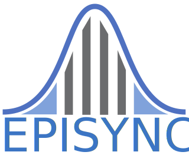

# NEDSS-EpiSync


A set of component services for:
- Creating EpiSync Data Dictionary
- Validating EpiSync CSV data
- Publishing EpiSync CSV data

## Quickstart

```bash
$ make build
$ make up
docker compose up -d
[+] Running 5/5
 ⠿ Container episync-mvps-s3  Started                                                                                                                                                                                                                1.3s
 ⠿ Container episync-db       Started                                                                                                                                                                                                                1.2s
 ⠿ Container episync-dd       Started                                                                                                                                                                                                                1.3s
 ⠿ Container episync-test     Started                                                                                                                                                                                                                0.8s
 ⠿ Container episync-publish  Started                            
```

Then open browser to http://localhost:8014/docs for the `dictionary` and `validate` service Swagger UI's

To bring down the EpiSync stack:
```bash
$ make stop
docker compose stop
[+] Running 5/5
 ⠿ Container episync-publish  Stopped                                                                                                                                                                                                               10.5s
 ⠿ Container episync-mvps-s3  Stopped                                                                                                                                                                                                                4.3s
 ⠿ Container episync-test     Stopped                                                                                                                                                                                                                0.0s
 ⠿ Container episync-db       Stopped                                                                                                                                                                                                                0.5s
 ⠿ Container episync-dd       Stopped                                                                                                                                                                                                                0.8s                                                                              0.3s
```

