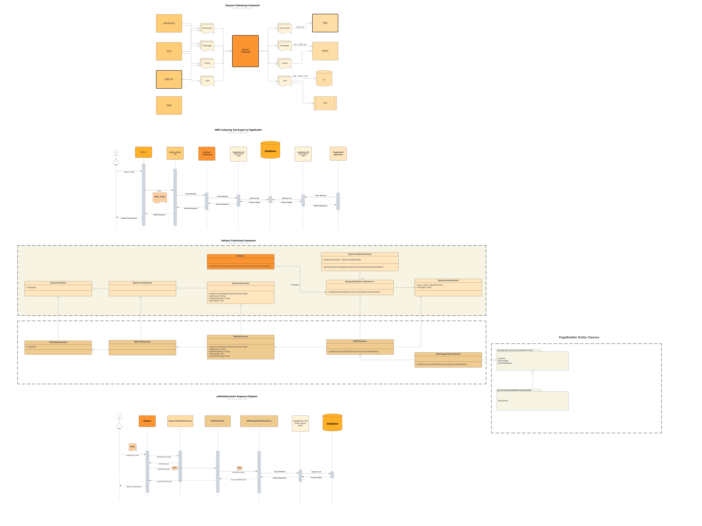

# NEDSS-EpiSync


## Summary
EpiSync is a set of technical ideas, components and services to work across the entire public data with integration to 
STLT Integrated Surveillance Systems (NBS, EpiTrax, etc). EpiSync is designed to provide access control for different types
of data and help existing systems adopt the EpiSync standard.

The services are implemented in form of containerized environment and currently include:
- [EpiSync Framework](./episync/README.md)
`ingesting machine-readable MMG into NBS; export an MMG from NBS`
- [EpiSync CLI](./cli/README.md)
`EpiSync Data Dictionary lifecycle, validating and Publishing EpiSync data`
- [BDD testing](./services/test/README.md) `Karate and behave tests for various data aspects` 

## Quickstart

To build and start the entire containerized environment:

```bash
$ make build
$ make up
```

To access main application visit http://localhost:8088/swagger-ui/index.html This Swagger UI entry point provides access to `MMG processing` and experimental `HL7 XML` and `data feed` operations

To access Data Dictionary API visit http://localhost:8014/docs for the `dictionary` and `validate` service Swagger UI's

To bring down the EpiSync stack:
```bash
$ make stop
```

## Docker Stack
```bash
$ docker ps
CONTAINER ID   IMAGE                                              COMMAND                  CREATED          STATUS                            PORTS                                                 NAMES
535771dbfd1f   nedss/episync-dd:latest                            "/opt/episync/venv/b…"   24 seconds ago   Up 3 seconds                      0.0.0.0:8014->8014/tcp, :::8014->8014/tcp             episync-dd
a191f02506b5   nedss/episync-cli:latest                           "tail -f requirement…"   24 seconds ago   Up 3 seconds                                                                            episync-cli
2589385ab256   postgres:latest                                    "docker-entrypoint.s…"   24 seconds ago   Up 3 seconds (health: starting)   0.0.0.0:5432->5432/tcp, :::5432->5432/tcp             episync-db
a2bc7ffe39a0   nedss/episync-publish:latest                       "java -jar -Duser.ti…"   24 seconds ago   Up 3 seconds                      0.0.0.0:8088->8088/tcp, :::8088->8088/tcp             episync-publish
52f5103e7e45   quay.io/minio/minio:RELEASE.2023-05-04T21-44-30Z   "/usr/bin/docker-ent…"   3 hours ago      Up 4 seconds (health: starting)   0.0.0.0:9000->9000/tcp, :::9000->9000/tcp, 9001/tcp   minio1
9ef93a8ce7b6   quay.io/minio/minio:RELEASE.2023-05-04T21-44-30Z   "/usr/bin/docker-ent…"   3 hours ago      Up 4 seconds (health: starting)   9000-9001/tcp                                         minio3
d6bfcb0156de   dpage/pgadmin4                                     "/entrypoint.sh"         3 hours ago      Up 3 seconds                      443/tcp, 0.0.0.0:8008->80/tcp, :::8008->80/tcp        pgadmin
```
## Architecture
Below is the current architecture for EpiSync Data Dictionary that addresses the following requirements:
- Data Elements Stored in secure database, managed by existing tooling and best-practices
- Allow multiple users to access and manage the data dictionary without conflict, data integrity errors, or other similar concerns
- Allow stored data dictionary elements to be serialized into various formats such as JSON, CSV, HTML etc
- Fully dynamic and data driven (i.e. nothing is static)
- Easy to change, extend and manage
- Prevent logical errors or data corruption
- Supports transactional modifications
- Supports data element value constraints
- Re-uses existing architecture components and technology
- Cloud neutral


## Framework
The Episync Framework is currently in development and is designed to be a conversion framework between different messages, documents and formats that want to publish Episync Data to various destinations within the CDC.


https://lucid.app/documents/view/2e69559c-4418-41bd-9d74-53941bccfcb0