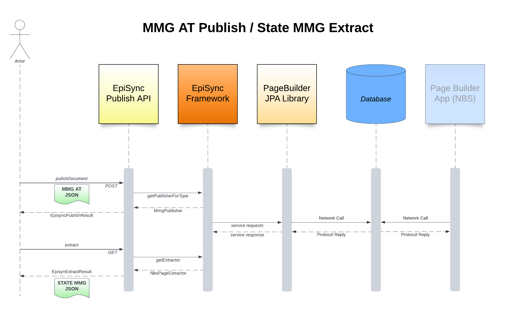

## Summary

The Episync Framework is designed to be a automated conversion framework between different messages, 
documents and formats that want to publish Episync Data to various destinations within the CDC.

## Current Status

At this stage, the framework facilitates two primary functionalities for data conversion::
- Import machine-readable MMGs (Message Mapping Guides) and combine it with other state-required data; 
producing an NBS template that meets 
both state and CDC requirements for case reporting
- Export a machine-readable MMG from an NBS page/template



## Prerequisites

Requires access to NEDSS Base System MSSQL database. To build and run the dockerized version of NBS db access and clone 
[https://github.com/CDCgov/NEDSS-Modernization](https://github.com/CDCgov/NEDSS-Modernization) repo and in `cdc-sandbox` directory
run
```bash
./build_classic.sh
```
For detailed instructions please visit [NEDSS-Modernization/cdc-sandbox](cdc-https://github.com/CDCgov/NEDSS-Modernization/tree/main/cdc-sandbox/README.md).

## Implementation

Set of services in docker container, accessible from the main `publish` app. Can be [built and run](../README.md#quickstart) as part 
of entire multi-container or separately (from repo root):

```bash
$ docker compose build episync-publish --no-cache
$ docker compose up episync-publish -d
```

###
To access MMG lifecycle operations visit http://localhost:8088/swagger-ui/index.html#/Episync%20MMG%20Processing for Swagger UI API resources.